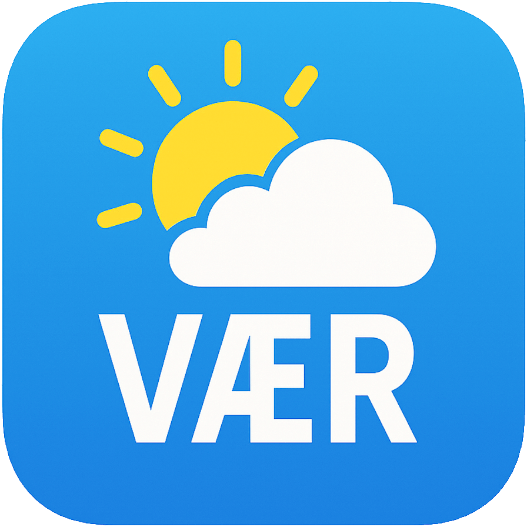

# VÆR - Model Context Protocol Weather+Place Server



An **opinionated Model Context Protocol (MCP) server** that provides high-level, LLM-friendly weather tools backed by **MET Norway’s Weather API (`api.met.no`)**, via an internal `metno-proxy` (Nginx reverse proxy + cache).

This server is designed to be used by MCP-compatible clients (e.g. AI assistants, IDEs, custom apps) to get structured weather information and simple “weather services” like activity planning and marine trip risk assessments.

---

## Getting Started

```bash
# Clone the repository
git clone git@github.com:bitjungle/vaer.git
cd vaer

# Start the stack (requires Docker)
make compose-build && make up

# Verify it's running
curl http://localhost:8080/healthz   # → ok
curl http://localhost:3000/health    # → {"status":"ok","transport":"http"}
```

That's it — you now have a running MCP server. See [Documentation](#documentation) for next steps.

---

## Features

- **Opinionated weather tools**
  - `weather.get_location_forecast` – normalized hourly forecast
  - `weather.get_nowcast` – short-term precipitation and conditions
  - `weather.get_air_quality` – air quality & AQI for Norwegian locations
  - `weather.get_recent_observations` – recent observed weather (Frost)
  - `weather.get_marine_conditions` – coastal/marine summary
  - `weather.assess_outdoor_activity_window` – "when is it nice outside?"
  - `weather.assess_marine_trip_risk` – simple marine risk evaluation

- **Norwegian place name resolution** (28,115 places)
  - `places.resolve_name` – resolve Norwegian place names to coordinates
  - Powered by Kartverket Stedsnavn (official Norwegian place names register)
  - Supports queries like "What's the weather in Bergen?"
  - Intelligent matching with FTS5 full-text search, confidence scoring and disambiguation
  - Local SQLite database (6.09 MB), ~5ms query latency

- **MCP-native**
  - Exposes **tools**, **resources**, and **prompts** using the MCP specification.
  - Supports **stdio** and **HTTP** transports.

- **Backed by `metno-proxy`**
  - Uses your existing Nginx proxy for:
    - Proper `User-Agent` handling (required by MET Norway)
    - Caching and rate limiting
    - Health checks

- **Structured, consistent outputs**
  - Normalized units (°C, m/s, mm/h, etc.)
  - Structured JSON-like responses + short textual summaries
  - Includes metadata about data source, licensing and cache freshness

- **Attribution & compliance**
  - Built-in resources for MET Norway license & credit lines.
  - Designed to respect MET usage guidelines.

---

## Architecture

High-level architecture:

```text
MCP Client (ChatGPT, IDE, custom app)
        │  (MCP / JSON-RPC)
        ▼
   Vær Server
        ├─ Weather Domain (MET-backed)
        │    │  (HTTP, internal)
        │    ▼
        │  metno-proxy (Nginx: cache, UA, rate limit)
        │    │  (HTTPS)
        │    ▼
        │  api.met.no (MET Norway Weather API)
        │
        └─ Places Domain (Norway gazetteer)
             │  (local SQLite query)
             ▼
           data/places.db (Stedsnavn-derived)
````

* The MCP server **never calls `api.met.no` directly**.
* All upstream traffic goes through `metno-proxy`.
* Place name resolution uses a **local SQLite database** (no network calls).

---

## Requirements

* **Runtime**

  * Node.js 24+ (LTS or newer)

* **MET proxy**

  * A running `metno-proxy` container or service that:

    * Proxies `/weatherapi/...` to `https://api.met.no/...`
    * Sets a compliant `User-Agent`
    * Optionally enables caching & rate limiting

* **Docker + Compose v2** (for Docker deployments)

  * **macOS/Windows**: Install [Docker Desktop](https://www.docker.com/products/docker-desktop/) (includes everything)
  * **Linux servers**: Install Docker CE from Docker's official repository — see [docs/docker-linux.md](docs/docker-linux.md)

* **Places Database** (included)

  * `data/places.db` (28,115 Norwegian places, 6.09 MB) is included in the repository
  * No setup required — works out of the box after `git clone`
  * Developers can regenerate from source — see [docs/etl-pipeline.md](docs/etl-pipeline.md)

* **MCP Client**

  * Any client that supports MCP servers over stdio or HTTP.

---

## Configuration

The MCP server is configured via environment variables:

### Required

* `METNO_PROXY_BASE_URL`
  Base URL to the Nginx proxy (e.g. `http://localhost:8080` for dev, `http://metno-proxy:80` for Docker).

### Proxy & Timeouts

* `METNO_TIMEOUT_MS` — Upstream HTTP timeout (default: `5000`ms)
* `METNO_CONNECT_TIMEOUT_MS` — Connection timeout (default: `2000`ms)

### Frost API (Observations)

* `FROST_CLIENT_ID` — Client ID for Frost API (get from https://frost.met.no/auth/requestCredentials.html)
* `FROST_BASE_URL` — Override Frost API base URL (default: `https://frost.met.no`)
* `FROST_TIMEOUT_MS` — Frost API timeout (default: `10000`ms)

### Server

* `VAER_PORT` — Port for HTTP transport. If not set, server uses stdio transport.
* `VAER_LOG_LEVEL` — Logging level: `debug`, `info`, `warn`, `error` (default: `info`)

### Authentication

* `VAER_AUTH_MODE` — Authentication mode: `none`, `api-key`, `jwt` (default: `none`)
* `VAER_API_KEY` — API key value (required if `VAER_AUTH_MODE=api-key`)

### Places Database

* `PLACES_DB_PATH` — Path to SQLite places database (default: `./data/places.db`)

---

## Usage

1. **Run `metno-proxy`**
   Start the Nginx-based proxy that fronts `api.met.no`.

2. **Run the Vær server**
   Start the MCP server process (via `node`, `npm`, `pnpm`, or Docker), pointing it at `METNO_PROXY_BASE_URL`.

3. **Connect from an MCP client**
   Configure your MCP-compatible client to connect to this server:

   * via **stdio** (local)
   * or via **HTTP** (remote), using the configured port and optional API key.

4. **Call tools from the client**
   The client can now call any of the 7 implemented tools:

   **Data Tools:**
   * `weather.get_location_forecast` – Global weather forecasts
   * `weather.get_nowcast` – Nordic 2-hour precipitation
   * `weather.get_air_quality` – Norway air quality & AQI
   * `weather.get_marine_conditions` – Coastal marine weather
   * `weather.get_recent_observations` – Observed weather (Frost API)

   **Service Tools:**
   * `weather.assess_outdoor_activity_window` – Activity planning with comfort scoring
   * `weather.assess_marine_trip_risk` – Marine trip risk assessment

   **Places Tool:**
   * `places.resolve_name` – Resolve Norwegian place names to coordinates

---

## Repository Layout

```text
.
├─ src/                       # TypeScript source code
│  ├─ index.ts               # MCP server entry point
│  ├─ tools/                 # 8 MCP tools (weather.* + places.*)
│  ├─ resources/             # MCP resources
│  ├─ prompts/               # MCP prompts
│  ├─ domain/                # Shared utilities
│  └─ places/                # Places module
├─ data/
│  └─ places.db              # Norwegian places database (included)
├─ docs/                      # Documentation
│  ├─ getting-started.md     # Deployment guide
│  ├─ development.md         # Developer setup
│  ├─ design.md              # Architecture & API specs
│  └─ ...                    # See docs/README.md
├─ metno-proxy/               # Nginx reverse proxy
├─ scripts/etl/               # Places ETL (developer-only)
├─ tests/                     # Test suites
├─ docker-compose.yml         # Full stack orchestration
└─ Makefile                   # Build commands
```

---

## Quick Start (Development)

### Prerequisites
- Node.js 24+ LTS
- Docker Desktop (macOS/Windows) or Docker + Compose v2 (Linux — see [Requirements](#requirements))

### Running the Full Stack

```bash
# Build and start all services
make compose-build
make up

# Verify services are running
docker compose ps

# Test endpoints
curl http://localhost:8080/healthz
curl http://localhost:3000/health
```

Both services should show as "healthy":
- **metno-proxy**: `http://localhost:8080` (nginx proxy to api.met.no)
- **vaer**: `http://localhost:3000` (MCP server with HTTP transport)

**For detailed setup instructions, see [docs/development.md](docs/development.md).**

### Testing

```bash
# Run all tests
npm test

# Unit tests only
npm run test:unit

# Integration tests (requires metno-proxy running)
METNO_PROXY_BASE_URL=http://localhost:8080 npm run test:integration

# Test with MCP Inspector
npm run build
METNO_PROXY_BASE_URL=http://localhost:8080 npx @modelcontextprotocol/inspector node dist/index.js
```

For detailed testing instructions, see [docs/development.md](docs/development.md).

---

## Deployment

The Vær server can be deployed in multiple ways:

### Docker Compose (Recommended)

Deploy the full stack (metno-proxy + vaer) with a single command:

```bash
# 1. Build and start all services
make compose-build
make up

# 2. Verify deployment
docker compose ps
curl http://localhost:8080/healthz

# 3. View logs
make compose-logs

# 4. Stop services
make down
```

**Environment Configuration:**

Create a `.env` file in the project root:
```bash
# Required: Your User-Agent for MET Norway API
METNO_USER_AGENT=my-service/1.0 contact@example.com

# Optional: Frost API credentials for observations
FROST_CLIENT_ID=your-frost-client-id

# Optional: Logging level
VAER_LOG_LEVEL=info
```

### Standalone Docker

Build and run the MCP server image directly:

```bash
# Build image
docker build -t vaer:latest .

# Run with environment variables
docker run -d \
  --name vaer \
  -e METNO_PROXY_BASE_URL=http://metno-proxy:80 \
  -e VAER_LOG_LEVEL=info \
  -v $(pwd)/data:/app/data:ro \
  vaer:latest
```

### MCP Client Configuration

Connect MCP clients (Claude Desktop, VS Code, etc.) to the server:

**Claude Desktop** (`~/Library/Application Support/Claude/claude_desktop_config.json`):
```json
{
  "mcpServers": {
    "vaer": {
      "command": "node",
      "args": ["/path/to/vaer/dist/index.js"],
      "env": {
        "METNO_PROXY_BASE_URL": "http://localhost:8080"
      }
    }
  }
}
```

**Docker-based setup:**
```json
{
  "mcpServers": {
    "vaer": {
      "command": "docker",
      "args": [
        "run", "--rm", "-i",
        "--network", "vaer_vaer-network",
        "-e", "METNO_PROXY_BASE_URL=http://metno-proxy:80",
        "vaer:latest"
      ]
    }
  }
}
```

See [`examples/client-configs/`](examples/client-configs/) for more configuration examples.

### Production Deployment

For production deployments, see [docs/getting-started.md](docs/getting-started.md):
- Docker Compose production configuration
- Kubernetes manifests
- Security considerations
- Monitoring & operations

---

## Documentation

| Guide | Description |
|-------|-------------|
| [Getting Started](docs/getting-started.md) | Production deployment guide |
| [Development](docs/development.md) | Local setup, testing, contributing |
| [Design](docs/design.md) | Architecture, API schemas, tool specifications |
| [Docker on Linux](docs/docker-linux.md) | Installing Docker CE on Ubuntu/Debian |
| [Metno Proxy](docs/metno-proxy.md) | Nginx proxy configuration |
| [Observability](docs/observability.md) | Metrics, logging, debugging |
| [ETL Pipeline](docs/etl-pipeline.md) | Regenerating places.db (developer-only) |
| [History](docs/history.md) | Implementation history |
| [Roadmap](docs/roadmap.md) | Future plans |

See [docs/README.md](docs/README.md) for the complete documentation index.

---

## License

VÆR is open-source software licensed under the MIT License. However, the author respectfully requests that it not be used for military, warfare, or surveillance applications.